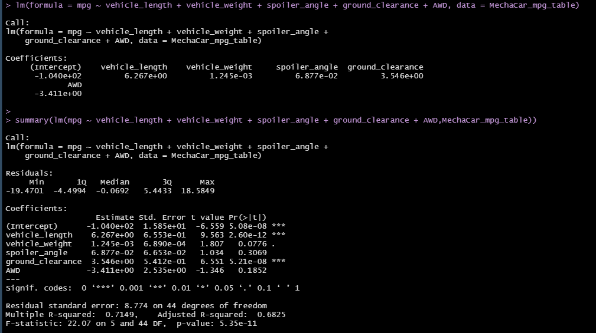
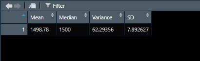
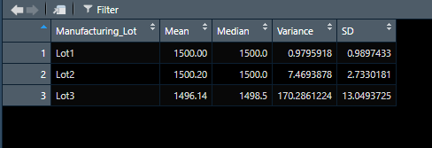
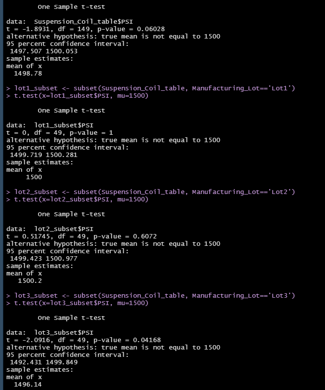

# MechaCar_Statistical_Analysis

## Table of Contents
* [Project title](#project-title)
* [Technologies](#technologies)
* [Overview](#overview)
* [Linear Regression to Predict MPG](#linear-regression-to-predict-mpg)
* [Trip Analysis](#trip-analysis)
* [T-Tests on Suspension Coils](#t-tests-on-suspension-coils)
* [Study Design MechaCar vs Competition](#study-design-mechacar-vs-competition)


## Project title
MechaCar Statistical Analysis

## Technologies
[RStudio Version 1.4.1106](https://www.rstudio.com/products/rstudio/download/#download)


## Overview
The purpose of this analysis is to offer insights on the AutosRUs’ newest prototype, the MechaCar, which is suffering from production troubles that are blocking the manufacturing team’s progress, and review the production data for insights that may help the manufacturing team. In order to conduct this analysis, I am using these two given datasets: 
1. [MechaCar_mpg.csv](https://github.com/Bominkkwon/MechaCar_Statistical_Analysis/blob/main/MechaCar_mpg.csv);
2. [Suspension_Coil.csv](https://github.com/Bominkkwon/MechaCar_Statistical_Analysis/blob/main/Suspension_Coil.csv)

containing information related to the mpg of MechaCar prototypes and the pounds per square inch (PSI) of the suspension coils from the manufacturing lots. I am using the programming language R and its dplyr library to:
*  Perform multiple linear regression analysis to identify which variables in the dataset predict the mpg of MechaCar prototypes.
*  Collect summary statistics on the pounds per square inch (PSI) of the suspension coils from the manufacturing lots.
*  Run t-tests to determine if the manufacturing lots are statistically different from the mean population.
*  Design a statistical study to compare vehicle performance of the MechaCar vehicles against vehicles from other manufacturers. For each statistical analysis, you’ll write a summary interpretation of the findings.


## Linear Regression to Predict MPG


(using the the simple (multiple) linear regression model: Yi=β0+β1xi+ϵi)
 ```studioR
 lm(formula = mpg ~ vehicle_length + vehicle_weight + spoiler_angle + ground_clearance + AWD, data = MechaCar_mpg_table)
 ```

There were two variables that provided a non-random amount of variance to the mpg values in the dataset: The vehicle length (Pr(>|t|) = 2.60e-12)  and the ground_clearance (Pr(>|t|) = 5.21e-08). Both of these variables have extremely small p-value -- which indicates that we have sufficient evidence to state that those parameters have significant impact on the mpg values in the dataset. Also, the linear regression shows that some of the independent variables had a significant effect on the dependent variable and therefore, the slope of the linear model is not considered to be zero. The r-squared value of this multiple linear regression model is the main indicator of whether the linear model predicts the mpg of the MechaCar: 0.71; and this model would be considered effective. 


## Trip Analysis

Total Summary Table:



Lot Summary Table:



Suspension coil presented in the dataset is normally distributed and densely gathered around the mean and median (1498.78 and 1500 respectively). The design specifications for the MechaCar suspension coils dictate that the variance of the suspension coils must not exceed 100 pounds per square inch and the variance of the PSI sample distribution is 62.29 meets the design specifications for the MechaCar. However, if we look at the the second table above, it shows that not all lots satisfy the design specifications; "Lot1" and "Lot2" meet the design specification at a variance of 0.98 PSI and 7.47 PSI respectfully, but "Lot3" exceeds the design specifications with its variance of 170.29 PSI. 


## T-Tests on Suspension Coils


P-value that was calculated using R-language t.test() function:
```Rstudio
t.test(x=Suspension_Coil_table$PSI,mu=1500)
lot1_subset <- subset(Suspension_Coil_table, Manufacturing_Lot=='Lot1') 
t.test(x=lot1_subset$PSI, mu=1500) 
lot2_subset <- subset(Suspension_Coil_table, Manufacturing_Lot=='Lot2') 
t.test(x=lot2_subset$PSI, mu=1500) 
lot3_subset <- subset(Suspension_Coil_table, Manufacturing_Lot=='Lot3') 
t.test(x=lot3_subset$PSI, mu=1500)
```
is 0.06028. Assuming our significance level was the common 0.05 percent, this p-value of 0.06 is above our significance level. Therefore, we do not have sufficient evidence to reject the null hypothesis, and we would state that the two means are statistically similar.

## Study Design: MechaCar vs Competition

To design a statistical study to compare performance of the MechaCar vehicles against performance of vehicles from other manufacturers, I would use the maintenance cost metric and my null hypothesis would be: all of the cars with high maintenance costs will have high mpg. The alternative hypothesis is the mean of our mpg dataset (with low maintenance cost) is greater than the mean of our competitors' mpg dataset (with low maintenance cost). I would use a paired t-test to compare the datasets. I would need to collect and "group by" such levels of maintenance costs and the types of cars and its mpg.


